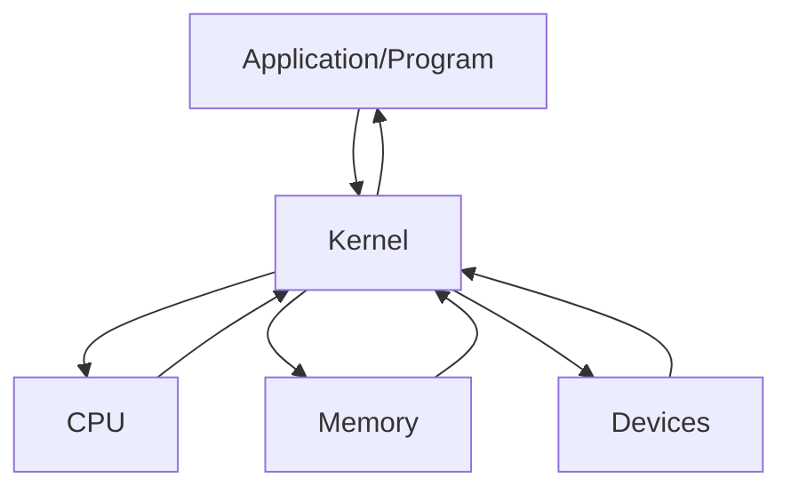

# vm

- Virtual machine의 약자
- os 내에서 다른 os를 설치, 실행 하는 프로그램
- LPPlayer 등을 포함하는 안드로이드 플레이어,java에서 사용하는 JVM, Ethereum에서 사용하는 EVM ,window/Linux/Android 등 거의 모든 os를 설치 할 수 있다.
- 단점 : 성능 저하를 이르킴
- kernel
- 커널이란 하드웨어와 프로그램을 연결해 주는 프로그램이다.
- 운영체제(os)에 포함되어 있다.



# WSL

- Windows SubSystem for Linux
- 윈도우에서 Linux OS를 사용하세 해주는 서비스
- Linux OS에는 Ubentu,cent OS, Redhat 등이 있다.
- mac OS도 Unix 기반의 os이다.
- WSL은 VM과 조금은 다르다. => VM은 하드웨어 성능을 나눠서 사용하지만 WSL은 Linux의 기반을 설치하지 않고 Windows의 기반을 사용하여 Linux를 실행한다.

- Linux의 커널을 사용하지 않는다.
- 성능 저하가 그렇게 크지 않다.
- 예전에는 OS 충돌이 있었으나 많은 패치로 요즘은 상당히 적어진 상태
- 아래의 명령어로 설치 가능한 Linux os를 확인할 수 있다.

```sh
wsl --list --online
```

```sh
wsl --install -d Ubuntu
```

# 기본적인 명령어들

- cd
  - 폴더 이동
  - / : root 경로(최상위 경로)
  - ~ : Home 경로(/home/사용자 이름)
- pwd
  - 현재 경로 출력
- ls
  - 현재 폴더의 내용을 출력
  - 옵션으로 대표적으로 a와l를 사용
  - ls -al : 권한 용량 등 모든 파일/ 폴더를 출력(숨긴 파일 포함)
- mkdir
  - 폴더 생성
- clear
  - 화면 초기화
- curl
  - 인터넷 접근(요청)

# Node.js

- 설치

  - 버전을 맞추는 해결을 nvm으로 사용한다.

- nvm : Node Version Manager
- nvm : ls-remote => 모든 버전을 보여준다.
- nvm : nvm ls => 여러버전을 설치후 선택해서 사용할 수 있다.
  - nvm use 18.12.1 버전을 사용한다.
